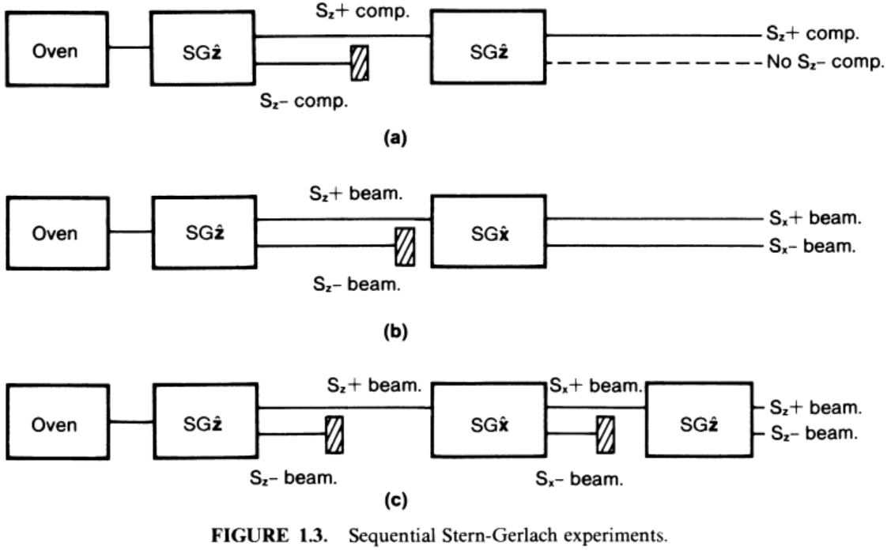

## 1.1 The Stern-Gerlach Experiment

第一节从一个稍微不同的角度介绍了一下Stern-Gerlach实验。其基本原理如原子物理中所介绍的，银原子的唯一一个处在非满壳层的电子自旋方向不同使银原子有不同的磁矩，通过空间上均匀变化的磁场后会在变化的方向上被分成两束。

书中讨论了这样的sequential S-G experiment：

在a中，连续布置两个z方向的SG装置，只让$S_z+$通过第一个装置，最后从第二个装置射出的也只有一束$S_z+$。这容易理解，因为第一个装置起了“滤掉”$S_z-$的作用。  
在b中，第二个装置是x方向的，最后出射的原子有$S_x+$和$S_z-$两束。这似乎说明了$S_z+$的原子在x方向的磁矩也是均匀分布的，一半是$S_x+$，另一半是$S_x-$。让我们继续看第三个序列。  
在c中，在b的后面再增加一个z方向的装置，并只让$S_x+$方向的原子进入第三个装置。而最后出射的原子中既有$S_z+$又有$S_z-$。这是个惊人的结果——$S_z-$的原子本应在第一个装置就被滤掉了，却再次出现在第三个装置的出射。这似乎是说，仅仅在中间加入一个x方向的装置，就使我们失去了对磁矩在z方向分布的信息（对比a）~~全部木大~~。

这让人想到另一个经典物理中的现象——光的偏振。我们可以让$S_x$和$S_z$对应xy方向和与xy方向夹角$45^\circ$的x'y'方向的偏振光，SG装置对应相应的偏振片，得到的就是上面的结果。而考虑我们对偏振光的描述，x'方向的偏振是x和y方向偏振的线性组合，我们推断这里原子的状态也应该由某种抽象的二维线性空间中的矢量来表示：
$$
\begin{aligned}
    \left|S_x;+\right>=\frac{1}{\sqrt{2}}\left|S_z;+\right>+\frac{1}{\sqrt{2}}\left|S_z;-\right>
    \\
    \left|S_x;-\right>=-\frac{1}{\sqrt{2}}\left|S_z;+\right>+\frac{1}{\sqrt{2}}\left|S_z;-\right>
\end{aligned}
$$
书中接下来讨论了$S_y$态的表示，它也应该是$S_z$的线性组合，且要和$S_x$区分开来。为此，书中将$S_y$对应成左旋和右旋偏振，相应的线性组合的系数则变成了$\frac{1}{\sqrt{2}}$和$ \pm\frac{i}{\sqrt{2}}$。书中进一步说明这个线性空间应该是定义在复数域上的。*（这里我存有一些疑问，如果是在二维空间中的话，是否就不必要引入复数了？如果在更高维的空间，是否还需要定义在其他的数域上？这只是数学巧合还是蕴含了物理上三维空间中的某种对称性？）*

## 1.2 Kets, Bras, and Operators

延续上一节的思路，我们认为物理系统的状态被**右矢**(ket)描述，它定义在复数域上的线性空间，形如$\left\|\alpha\right>$。右矢空间具有线性空间的诸多性质，这里不再赘述。

接下来需要介绍的是**左矢**(bra)空间。左矢空间是右矢空间的对偶空间，它和右矢一一对应。和右矢$\left\|\alpha\right>$对应的左矢就记作$\left<\alpha\right\|$。左矢和右矢的对偶映射保留了加法。需要注意的是，$c\left\|\alpha\right>$对应的左矢应该是$c^*\left<\alpha\right\|$。

一个左矢和一个右矢可以定义**内积**：$\left<\beta|\alpha\right>$。内积是一个线性运算，且满足：
- 共轭对称性：$$\left<\beta|\alpha\right>=\left<\alpha|\beta\right>^*$$
- 正定性：
$$\left<\alpha|\alpha\right>\geq0 $$
取等号仅当$\left\|\alpha\right>$是右矢空间的零矢量。

**算符**是一个双线性映射，将右矢映成右矢，或将左矢映成左矢。被相同的算符作用的互相对偶的左矢和右矢通常并不对偶，而$X\left\|\alpha\right>$对偶的左矢是$\left<\alpha\right\|X^\dagger$。$X^\dagger$称为算符$X$的厄米共轭。和自己的厄米共轭相等的算符称为厄米算符。*（这里的描述有些不清晰，因为仅凭上面的定义，$X$作用在左矢和右矢上原则上可以完全不相关。不过事实上并非如此，参见下面的结合公理）*

算符也可以定义乘法，和映射的乘法类似。显然有：
$$(XY)^\dagger=Y^\dagger X^\dagger $$
至此我们定义了这样几种“乘法”：内积、算符作用在（“乘”）左矢或右矢，算符的乘法。再定义外积：$\left\|\alpha\right>\left<\beta\right\|$。这些“乘法”是我们会涉及到的全部合法的乘法式。

结合公理说的是，对于任何合法的乘法式，结合的顺序是任意的。比如：
$$(\left|\alpha\right>\left<\beta\right|)\left|\gamma\right>=\left|\alpha\right>(\left<\beta|\gamma\right>) $$

这告诉我们，可以根据外积定义算符：
$$X=\left|\alpha\right>\left<\beta\right| $$
根据结合公理，$X$确是将一个右矢映成另一个右矢。*（事实上，结合公理无非是说算符在作用于左矢和作用于右矢上时，应该满足$(\left<\alpha\|X)\|\beta\right>=\left<\alpha\|(X\|\beta\right>)）$。只是给出了这一限制，以及让外积拥有算符的性质，其他的结合律都是显然的）* 可以证明：
$$X^\dagger= \left|\beta\right>\left<\alpha\right|$$

另一个常用的公式是：
$$\left<\beta|X|\alpha\right>=\left<\alpha|X^\dagger|\beta\right>^* $$

## 1.3 Base Kets and Matrix Representations

定义算符的本征右矢和本征值，对算符$A$，本征右矢是这样的右矢$\left\|\alpha\right>$，使得$A\left\|\alpha\right>=a'\left\|\alpha\right>$。其中$a'$是常数，称为本征值。书中将本征值为a'的本征右矢记为$\left\|a'\right>$。

若$A$是厄米的，我们有：
$$
\begin{aligned}
    \left<a''|A|a'\right>&=a'\left<a''|a'\right>
    \\ &=(\left<a'|A|a''\right>)^*=a''^*(\left<a'|a'\right>)^*
    \\ &=a''^*\left<a''|a'\right>
\end{aligned}
$$
即：
$$(a'-a''^*)\left<a''|a'\right>=0  $$
取$a'=a''$，有厄米算符的本征值都是实数；取$a'\neq a''$，有厄米算符不同的本征右矢是相互正交的。

我们假设$A$的本征右矢是完备的，可以通过其线性组合表示右矢空间中任意的右矢：
$$\left|\alpha\right>=\sum_{a'}c_{a'}\left|a'\right> $$
考虑$\left<a'\right\|$和$\left\|\alpha\right>$的内积，我们可以得出$c_{a'}=\left<a'\|\alpha\right>$。即：
$$\left|\alpha\right>=\sum_{a'}\left|a'\right>\left<a'|\alpha\right> \tag{1.3.1}$$
我们的结论是，**$A$的所有归一化的本征右矢构成了右矢空间中的一组单位正交完备基。**

1.3.1中也定义了**完备性关系**：
$$\sum_{a'}\left|a'\right>\left<a'\right|=\sum_{a'}\Lambda_{a'}=1 \tag{1.3.2}$$
其中$\Lambda_{a'}$是**投影算符**，其几何意义是将右矢投影到平行于$\left|a'\right>$的方向。

根据完备性关系，算符$X$可写为：
$$X=\sum_{a''}\sum_{a'}\left|a''\right>\left<a''\right|X\left|a'\right>\left<a'\right| $$
我们用一个$N\times N$的矩阵来表示$X$：$X_{ij}=\left< a^{(i)} \right| X \left| a^{(j)} \right>$。

可以证明，厄米共轭对应的矩阵表示就是共轭转置，算符相乘对应的就是矩阵乘法。后者的证明如下：
$$
\begin{aligned}
    XY&=\sum_{a''}\sum_{a'}\left|a''\right>\left<a''\right|XY\left|a'\right>\left<a'\right|
    \\ &=\sum_{a''}\sum_{a'}\left|a''\right>\left(\sum_{a'''}\left<a''\right|X\left|a'''\right>\left<a'''\right|Y\left|a'\right>\right)\left<a'\right|
\end{aligned}
$$
在中间插入一个单位算符的技巧十分常用，用相同的技巧，将左矢和右矢对应到分量组成的行矢量和列矢量，算符作用到左矢和右矢上就也成了矩阵乘法。内积和外积也同样。

## 1.4 Measurements, Observables, and the Uncertainty Relations

### 测量

让我们回到物理的讨论上来。右矢用于表示物理系统的状态，而算符代表的是**观测量**。这代表的是，对某个观测量进行测量，让系统的状态成为了对应的算符的某个本征态。我们无法确定的给出具体会变成哪个本征态，但可以给出归一化的态$\left\|\alpha\right>$变成本征态$\left\|a'\right>$的**概率**为$\left\|\left<a'\|\alpha\right>\right\|^2$。此时测量的结果就是对应的**本征值**。这被称为**测量公理**。

定义态$\left\|\alpha\right>$下观测量的平均值：
$$\left<A\right>=\left<\alpha|A|\alpha\right> $$
可以将其写成下面的形式：
$$
\begin{aligned}
    \left<A\right>&=\left<\alpha|A|\alpha\right>
    \\&=\sum_{a''}\sum_{a'}\left<\alpha|a''\right>\left<a''\right|A\left|a'\right>\left<a'|\alpha\right>
    \\&=\sum_{a'}a'\left|\left<a'|\alpha\right>\right|^2
\end{aligned}
$$
这说明观测量平均值的物理意义即为对含有大量相同态矢的粒子进行测量，测量的结果的平均值，亦即测量结果的期望。

### 1/2自旋系统

现在再来看1.1中的SG实验，记$S_z+$的态矢为$\left\|+\right>$，$S_z-$的态矢为$\left\|-\right>$。由sequential S-G experiment的b，应该有：
$$
\left|\left<+|S_x;+\right>\right|^2=\left|\left<-|S_x;+\right>\right|^2=\frac{1}{2}
$$
对$\left\|S_x;-\right>$也同样，考虑到$\left\|S_x;+\right>$和$\left\|S_x;-\right>$应正交，从而有：
$$
\left|S_x;\pm\right>=\frac{1}{\sqrt{2}}\left|+\right>\pm\frac{1}{\sqrt{2}}e^{i\delta_1}\left|-\right>
$$

$S_x$在本征态$\left\|S_x;\pm\right>$上的本征值为$\pm\hbar/2$，则可以构造算符$S_x$：
$$
\begin{aligned}
    S_x&=\frac{\hbar}{2}\left|S_x;+\right>\left<S_x;+\right|-\frac{\hbar}{2}\left|S_x;-\right>\left<S_x;-\right|
    \\ &=\frac{\hbar}{2}(e^{-i\delta_1}\left|+\right>\left<-\right|+e^{i\delta_1}\left|-\right>\left<+\right|)
\end{aligned}
$$
在y方向也同样：
$$
\begin{aligned}
    \left|S_y;\pm\right>=\frac{1}{\sqrt{2}}\left|+\right>\pm\frac{1}{\sqrt{2}}e^{i\delta_2}\left|-\right>
    \\
    S_y=\frac{\hbar}{2}(e^{-i\delta_2}\left|+\right>\left<-\right|+e^{i\delta_2}\left|-\right>\left<+\right|)
\end{aligned}
$$
考虑到xy方向也并不相关，也应该有：
$$
\left|\left<S_x;+|S_y;\pm\right>\right|^2=\left|\left<S_x;-|S_y;\pm\right>\right|^2=\frac{1}{2}
$$
我们得到：
$$\delta_2-\delta_1=\pm\frac{\pi}{2} $$
不妨取$\delta_1=0$（$\left\|+\right>$定义的任意性给出了这个自由度），$\delta_2=\pi/2$（这个自由度则由空间坐标的左手系/右手系的选取给出），这就对应了我们之前基于偏振光的猜测，也说明了三个方向上线性组合的系数不能全是实数。

我们有：
$$
\begin{aligned}
    S_x=\frac{\hbar}{2}(\left|+\right>\left<-\right|+\left|-\right>\left<+\right|)
    \\
    S_y=\frac{\hbar}{2}(-i\left|+\right>\left<-\right|+i\left|-\right>\left<+\right|)
    \\
    S_z=\frac{\hbar}{2}(\left|+\right>\left<+\right|+\left|-\right>\left<-\right|)
\end{aligned}
$$
得到它们的对易关系：
$$[S_i,S_j]=i\epsilon_{ijk}\hbar S_k$$
其中对易子的定义为：$[A,B]=AB-BA$。定义$S^2=S_x^2+S_y^2+S_z^2$，也有：
$$[S^2,S_i]=0$$
这具有角动量的对易关系的性质。

### 相容观测量

对应的算符的对易子为零的两个观测量称为相容观测量。对相容观测量$A$和$B$，有：
$$\left<a''\right|[A,B]\left|a'\right>=(a''-a')\left<a''\right|B\left|a'\right>=0 $$
则应有（不考虑简并，即不同的本征右矢对应同一个本征值，因为一般来说总可以选取另外一个观测量来区分简并的右矢）：
$$\left<a''\right|B\left|a'\right>=\left<a''\right|B\left|a'\right>\delta_{a'a''}$$

从而，
$$
\begin{aligned}
    B\left|a'\right>&=\sum_{a''}\left|a''\right>\left<a''\right|B\left|a'\right>
    \\&=\left<a'\right|B\left|a'\right>\left|a'\right>
\end{aligned}
$$
这说明$A$和$B$具有相同的本征右矢，可以将其记作$\left\|a',b'\right>$。这也是“相容”的含义——对B的测量不会破坏A的信息，因为它们的本征态是相同的，先测量A再测量B，第二次测量不会改变态矢（以1的概率塌缩到原本的态）。

与相容观测量相反的是不相容观测量，即对易子非零的观测量。对不相容观测量，后面的测量会破坏前面的测量的信息（因为塌缩到了不同的本征态上）。

### 不确定性关系

对观测量$A$，定义这样一个算符：
$$\Delta A=A-\left<A\right> $$
$A$的弥散度定义为$\Delta A$的平均值：
$$\left<(\Delta A)^2\right>=\left<A^2-2A\left<A\right>+\left<A\right>^2\right>=\left<A^2\right>-\left<A\right>^2 $$
和方差类似。

现在我们可以证明**不确定性关系**：

$$\left<(\Delta A)^2\right>\left<(\Delta B)^2\right>\geq \frac{1}{4}\left|\left<[A,B]\right>\right|^2 $$

首先，需要以下引理：
- Schwarz不等式：
$$\left<\alpha|\alpha\right>\left<\beta|\beta\right>\geq\left|\left<\alpha|\beta\right>\right|^2 $$
（考虑$\left|\alpha+\lambda\beta\right>$的模长的非负性）
- 厄米算符的平均值是实数
- 反厄米算符（$C=-C^\dagger$）的平均值是纯虚数

对任意右矢$\left\|\gamma\right>$，取$\left\|\alpha\right>=\Delta A\left\|\gamma\right>,\left\|\beta\right>=\Delta B\left\|\gamma\right>$，带入Schwarz不等式，有：
$$\left<(\Delta A)^2\right>\left<(\Delta B)^2\right>\geq\left|\left<\Delta A\Delta B\right>\right|^2 $$
（其中利用到了$A$和$B$的厄米性），而$\Delta A\Delta B$可以写为厄米部分和反厄米部分之和：
$$\Delta A\Delta B=\frac{1}{2}[\Delta A,\Delta B]+\frac{1}{2}\{\Delta A,\Delta B\} $$
对上式求平均值，第一项是实数，第二项是纯虚数。求模长则有不确定性关系。

## 1.5 基的变换

基的选取不是唯一的，这节主要讨论不同基之间的变换，或被称为**表象变换**。

首先，任意两组基$\{\left\|a'\right>\}$和$\{\left\|b'\right>\}$之间，都可以通过一个幺正算符联系起来：$\left\|b^{(k)}\right>=U\left\|a^{(k)}\right>$。

所谓幺正算符，是这样的算符$U$，$UU^\dagger=U^\dagger U=1$。这里的坐标变换算符可以这样定义：

$$U=\sum_k\left|b^{(k)}\right>\left<a^{(k)}\right|$$

在b表象上，分量的值为：
$$\left<b^{(k)}|\alpha\right>=\sum_l \left<b^{(k)}|a^{(l)}\right>\left<a^{(l)}|\alpha\right>=\sum_l \left<a^{(k)}|U^\dagger|a^{(l)}\right>\left<a^{(l)}|\alpha\right> $$
在新表象下的分量即为$U^{\dagger}$在旧表象下的矩阵乘旧表象下的分量。

类似的方法可以证明，算符在新表象下的矩阵为：
$$X'=U^\dagger XU$$
是一个相似变换。

不同表象下的算符的变换启发我们，如果根据算符$A$定义一个新算符$B$，它在新表象下的矩阵表示和旧表象下相同，那它应该和$A$有相同的本征值，其本征态的分量也和$A$在旧表象的分量相同。也就是说，它们的**观测值之间具有相同的概率分布。**

**幺正等效观测量**定义为：
$$B=UAU^{-1}$$
我们有：
$$UAU^{-1}(U\left|a'\right>)=B(U\left|a'\right>)=a'(U\left|a'\right>) $$
这符合上面的论述。